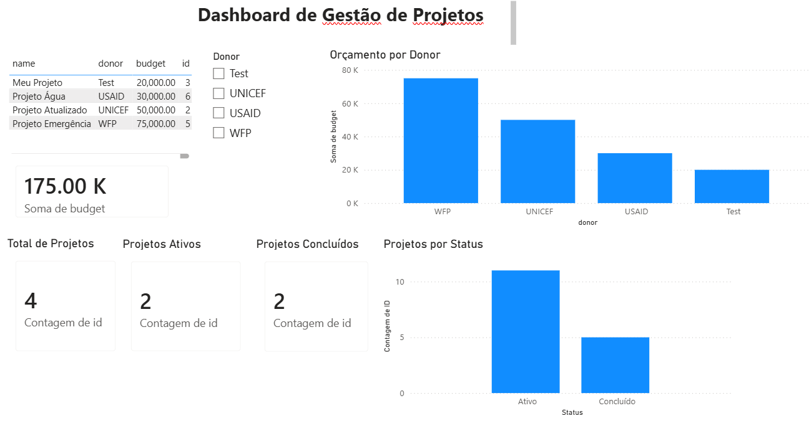

# Project Management Dashboard

## Dashboard Preview

This project is a full-stack solution for managing projects using:

- Node.js (Express API)
- PostgreSQL database
- Power BI dashboard

## Features

- Create, update, and delete projects
- Track project budgets
- Filter by donor
- Visualize project status (Active vs Completed)

## Tech Stack

- Backend: Node.js + Express
- Database: PostgreSQL
- Visualization: Power BI

## How to Run

1. Install dependencies:
   npm install

2. Start server:
   node index.js

3. API runs on:
   http://localhost:3000

## Author

Adair Latiff
