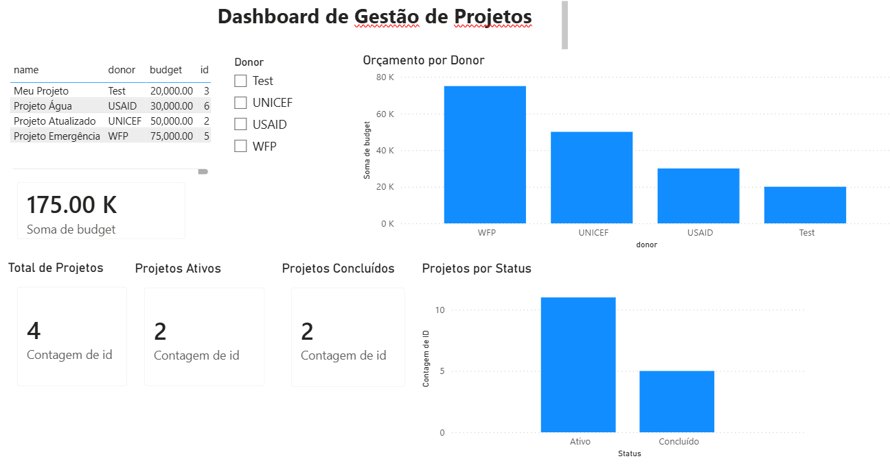

# 🚀 IPPMIS - Project Portfolio Management System

Cloud-native Enterprise Project Portfolio Management Information System built with:

- Node.js
- Express.js
- PostgreSQL
- Docker
- Kubernetes
- NGINX
- Power BI

---



# ✨ Features

- Full CRUD Project Management
- Budget Tracking
- Financial Execution Monitoring
- Project Progress Monitoring
- Donor Filtering
- CSV Import
- Excel Export
- REST API
- Kubernetes Deployment
- Persistent PostgreSQL Storage
- Docker Containerization

---

# 🛠 Tech Stack

| Technology | Usage |
|---|---|
| Node.js | Backend API |
| Express.js | REST API |
| PostgreSQL | Database |
| Docker | Containerization |
| Kubernetes | Orchestration |
| NGINX | Reverse Proxy |
| Power BI | Analytics Dashboard |

---

# ☁ Kubernetes Architecture

- Frontend Deployment
- Backend Deployment
- PostgreSQL Deployment
- Persistent Volume Claim
- Secrets Management
- Ingress Controller
- Services Networking

---

# 🚀 Running Locally

## Clone repository

```bash
git clone https://github.com/adairlatiff-boop/Repository-name-project-management-dashboard.git
```

---

## Install dependencies

```bash
npm install
```

---

## Configure environment variables

Create `.env`

```env
DB_HOST=localhost
DB_USER=postgres
DB_PASSWORD=1234
DB_NAME=ippmis
DB_PORT=5432
```

---

## Run backend

```bash
node index.js
```

---

# 🐳 Docker

Build image:

```bash
docker build -t ippmis .
```

Run container:

```bash
docker run -p 3000:3000 ippmis
```

---

# ☁️ Cloud-Native Deployment

This application was designed using modern cloud-native architecture principles:

- Containerized with Docker
- Orchestrated using Kubernetes
- Scalable microservice-style deployment
- Persistent PostgreSQL storage
- Ingress-based routing
- Environment variable configuration
- Infrastructure ready for cloud deployment

The system can be deployed in:

- Minikube
- Azure Kubernetes Service (AKS)
- Amazon EKS
- Google Kubernetes Engine (GKE)
- On-premises Kubernetes clusters

# ☸ Kubernetes Deployment

Apply manifests:

```bash
kubectl apply -f k8s/
```

---

# 📊 API Endpoints

| Method | Endpoint | Description |
|---|---|---|
| GET | /projects | List projects |
| POST | /projects | Create project |
| PUT | /projects/:id | Update project |
| DELETE | /projects/:id | Delete project |

---

# 👨‍💻 Author

Adair Latiff

---

# 🔥 Future Improvements

- Authentication System
- Role-Based Access
- CI/CD Pipeline
- Cloud Deployment
- Monitoring & Logging
- HTTPS/SSL
- Real-time Notifications